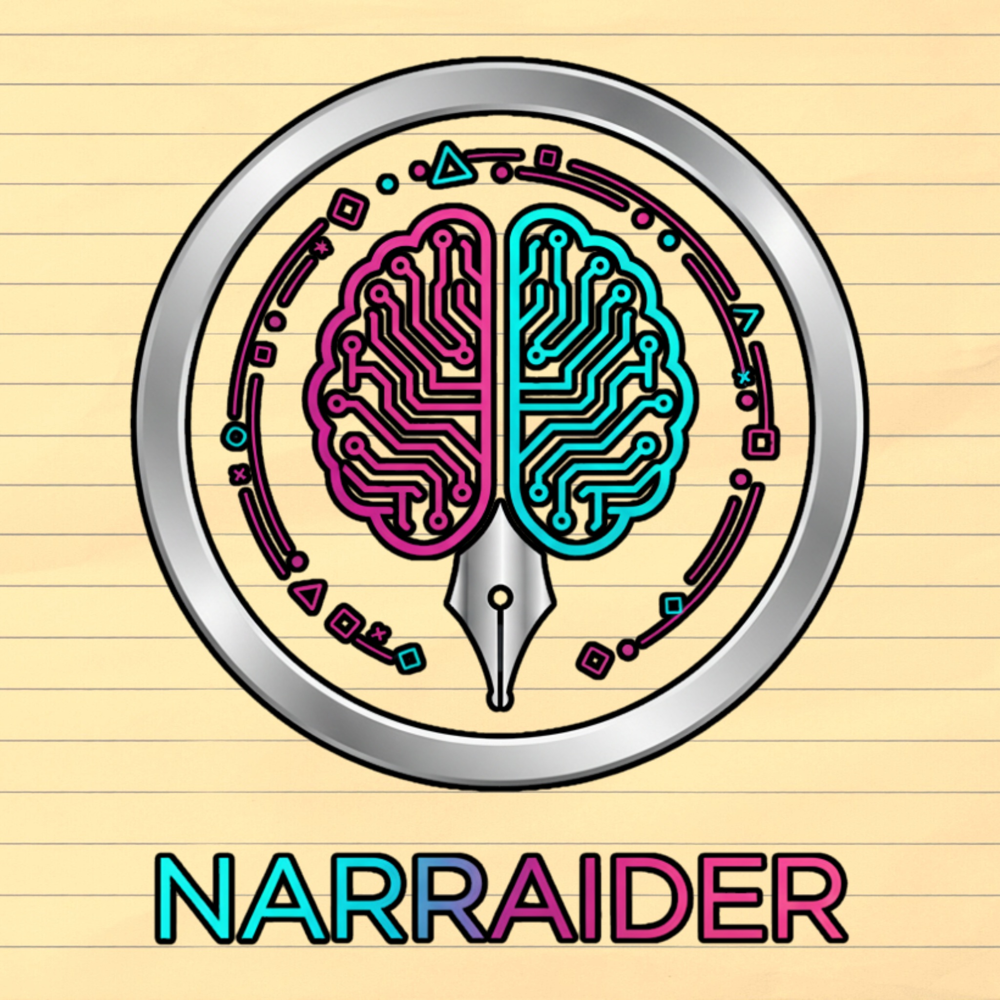

# Installation Guide for New Users



**Created by Andreas "Uriel1339" Lopez**

This guide walks you through installing NarrAider from a fresh clone of the GitHub repository.

## What You're Installing

NarrAider is a **local AI tool** that runs entirely on your computer. You'll need:
1. This code (from GitHub)
2. Python dependencies (`requests` library)
3. llama.cpp server (to run AI models)
4. At least one AI model (.gguf file)

**Nothing runs in the cloud** - everything stays on your machine.

---

## Step 1: Clone the Repository

```bash
git clone https://github.com/yourusername/NarrAider.git
cd NarrAider
```

Or download the ZIP from GitHub and extract it.

**What you'll have after cloning**:
```
NarrAider/
├── narraider.py                      # Core engine
├── narraider_unified.py              # Main GUI with setup wizard
├── narraider_gui.py                  # Simple GUI
├── narraider_config.json.template    # Config template (for reference)
├── requirements.txt                  # Python dependencies
├── README.md, QUICKSTART.md, etc.    # Documentation
└── example_workflows.py              # Batch generation examples
```

**What's NOT in the repository** (you'll download these):
- `narraider_config.json` (auto-created on first run)
- `outputs/` folder (auto-created)
- AI models (too large for Git, 5-17GB each)
- llama.cpp server (platform-specific binary)

---

## Step 2: Install Python Dependencies

**Verify Python version** (3.8 or higher required):
```bash
python3 --version
```

**Install dependencies**:

```bash
pip install -r requirements.txt
```

This installs:
- `requests` (for talking to llama.cpp server)
- `Pillow` (optional, for future image features)

**Platform-Specific Notes**:

**Linux (Debian/Ubuntu)**:
```bash
sudo apt-get install python3-tk
pip install -r requirements.txt
```

**Linux (Fedora)**:
```bash
sudo dnf install python3-tkinter
pip install -r requirements.txt
```

**macOS**:
```bash
# Tkinter included with Python from python.org
pip3 install -r requirements.txt
```

**Windows**:
```bash
# Tkinter included with Python
pip install -r requirements.txt
```

---

## Step 3: First Launch - Setup Wizard

**Run the unified GUI**:
```bash
python3 narraider_unified.py
```

**What happens next**:

### Automatic Setup Wizard Appears

Since `narraider_config.json` doesn't exist yet (it's not in Git), the **Setup Wizard** launches automatically.

#### Step 1: GPU Detection
- Automatically detects your NVIDIA GPU using `nvidia-smi`
- Determines your tier (Tier 1: 24GB, Tier 2: 10GB)
- You can manually select your tier if detection fails

#### Step 2: Model Recommendations
- Shows model recommendations based on your GPU
- Provides direct download links to HuggingFace
- Explains which models to download

**Tier 1 (RTX 4090/3090 - 24GB VRAM)**:
- Gemma-3-27B-IT (~17GB) - Worldbuilding
- Amoral-Gemma3-27B (~17GB) - Explicit content

**Tier 2 (RTX 3080/4070 - 10-12GB VRAM)**:
- MythoMax L2 13B (~8GB) - Worldbuilding
- Stheno v3.2 8B (~5GB) - Explicit content

#### Step 3: llama.cpp Server
- Provides download links for llama.cpp releases
- Explains platform-specific installation
- Opens your file browser to help you organize files

#### Step 4: Verification
- Checks if llama-server.exe exists
- Checks if .gguf models exist
- Verifies Python dependencies
- Shows what's missing (if anything)

### After the Wizard

When you close the wizard, NarrAider will:
1. Call `load_config()` which creates `narraider_config.json` with default paths
2. Main GUI opens
3. You can now configure paths in the Settings tab

---

## Step 4: Configure Paths

**Two ways to configure**:

### Option A: GUI Settings Tab
1. In NarrAider, click the **Settings** tab
2. Click "Browse" to select:
   - llama-server path (e.g., `C:/llama-server/llama-server.exe`)
   - Worldbuilding model path (e.g., `C:/models/gemma-3-27b-it-Q4_K_M.gguf`)
   - Explicit model path (optional)
3. Click "Save Settings"

### Option B: Edit Config Manually
1. Open `narraider_config.json` in a text editor
2. Update paths:

```json
{
  "llama_server_path": "C:/Users/YourName/llama-server/llama-server.exe",
  "models": {
    "worldbuilding": "C:/Users/YourName/ai-models/gemma-3-27b-it-Q4_K_M.gguf",
    "explicit": "C:/Users/YourName/ai-models/amoral-gemma3-27B-v2-Q4_K_M.gguf"
  },
  "server_port": 8081,
  "context_size": 8192,
  "gpu_layers": 99,
  "output_folder": "outputs",
  "keep_server_loaded": false,
  "generation_params": {
    "temperature": 0.8,
    "top_p": 0.9,
    "top_k": 40,
    "repeat_penalty": 1.1,
    "max_tokens": 2048
  }
}
```

**Path Tips**:
- Use forward slashes (`/`) even on Windows, or escape backslashes (`\\`)
- Absolute paths work best: `C:/Users/YourName/...`
- `~` doesn't work - use full path like `/Users/YourName/...`

---

## Step 5: Download Models

**Where to get models**: HuggingFace

### Tier 1 Models (24GB VRAM)

**Gemma-3-27B-IT** (Worldbuilding):
1. Visit: https://huggingface.co/bartowski/google_gemma-3-27b-it-GGUF
2. Download: `google_gemma-3-27b-it-Q4_K_M.gguf` (~17GB)
3. Save to your models folder

**Amoral-Gemma3-27B** (Explicit):
1. Visit: https://huggingface.co/mradermacher/amoral-gemma3-27B-v2-i1-GGUF
2. Download: `amoral-gemma3-27B-v2-i1-Q4_K_M.gguf` (~17GB)
3. Save to your models folder

### Tier 2 Models (10-12GB VRAM)

**MythoMax L2 13B** (Worldbuilding):
1. Visit: https://huggingface.co/TheBloke/MythoMax-L2-13B-GGUF
2. Download: `mythomax-l2-13b.Q4_K_M.gguf` (~7.9GB)
3. Save to your models folder

**Stheno v3.2 8B** (Explicit):
1. Visit: https://huggingface.co/bartowski/L3-8B-Stheno-v3.2-GGUF
2. Download: `L3-8B-Stheno-v3.2-Q4_K_M.gguf` (~4.9GB)
3. Save to your models folder

**Organize your models**:
```
C:/Users/YourName/ai-models/
├── google_gemma-3-27b-it-Q4_K_M.gguf
└── amoral-gemma3-27B-v2-i1-Q4_K_M.gguf
```

---

## Step 6: Download llama.cpp Server

**Where to get it**: https://github.com/ggerganov/llama.cpp/releases

### Windows

1. Go to releases page
2. Download based on your GPU:
   - **NVIDIA GPU**: `llama-b[XXXX]-bin-win-cuda-cu12.2.0-x64.zip`
   - **AMD/Intel GPU**: `llama-b[XXXX]-bin-win-vulkan-x64.zip`
   - **CPU only**: `llama-b[XXXX]-bin-win-avx2-x64.zip`
3. Extract to a folder (e.g., `C:/llama-server/`)
4. Remember the path to `llama-server.exe`

**Example folder structure**:
```
C:/llama-server/
├── llama-server.exe        ← This is what you need
├── llama-cli.exe
├── ggml.dll
└── (other DLLs)
```

### macOS

**Download binary**:
1. Visit releases page
2. Download:
   - **M1/M2/M3 Mac**: `llama-b[XXXX]-bin-macos-arm64.zip`
   - **Intel Mac**: `llama-b[XXXX]-bin-macos-x64.zip`
3. Extract and note path to `llama-server`

**Or build from source** (for Metal GPU acceleration):
```bash
git clone https://github.com/ggerganov/llama.cpp
cd llama.cpp
make
```

### Linux

**Build from source** (recommended):
```bash
git clone https://github.com/ggerganov/llama.cpp
cd llama.cpp
make

# For NVIDIA CUDA support:
make LLAMA_CUDA=1

# For AMD ROCm support:
make LLAMA_HIPBLAS=1
```

Server binary will be at: `./llama-server`

---

## Step 7: First Generation Test

**Launch NarrAider**:
```bash
python3 narraider_unified.py
```

**Generate your first character**:
1. Select **"Character Profile"** from dropdown
2. Enter prompt: `Elven ranger, 150 years old, expert tracker`
3. Click **"Generate"**
4. Wait 30-60 seconds
5. Check output in `outputs/characters/` folder

**If it works**: Congratulations! You're ready to create.

**If it doesn't work**: See Troubleshooting below.

---

## Troubleshooting

### "Config file not found"
- This is normal on first run
- narraider_config.json will be auto-created
- Edit it with your paths

### "Server failed to start"
- Check `llama_server_path` in config points to actual file
- Verify file exists: `ls /path/to/llama-server.exe`
- On Windows, make sure you downloaded the right architecture (CUDA vs CPU)

### "Model not found"
- Check `models.worldbuilding` path in config
- Verify .gguf file exists at that path
- Make sure you downloaded the full file (5-17GB)

### "CUDA out of memory"
- Your model is too large for your GPU
- Reduce `context_size` from 8192 to 4096
- Reduce `gpu_layers` from 99 to 50
- Download a smaller model (7B instead of 13B)

### "Generation takes forever"
- Normal on first load (model loads into VRAM)
- Subsequent generations are faster
- Set `keep_server_loaded: true` in config to avoid reload

### Server won't start on port 8081
- Another process is using port 8081
- Change `server_port` in config to 8082
- Or kill the process: `netstat -ano | findstr 8081` (Windows)

### GUI doesn't open
- Verify tkinter is installed: `python3 -m tkinter`
- On Linux: `sudo apt-get install python3-tk`
- Try simple GUI instead: `python3 narraider_gui.py`

---

## Folder Structure After Setup

```
YourProjectFolder/
│
├── NarrAider/                    # Git repository
│   ├── narraider.py
│   ├── narraider_unified.py
│   ├── narraider_config.json     # Created on first run
│   ├── outputs/                  # Auto-created
│   │   ├── characters/
│   │   ├── scenes/
│   │   └── ...
│   └── ...
│
├── ai-models/                    # Your models (NOT in Git)
│   ├── gemma-3-27b-it-Q4_K_M.gguf
│   └── amoral-gemma3-27B-v2-Q4_K_M.gguf
│
└── llama-server/                 # llama.cpp (NOT in Git)
    ├── llama-server.exe
    └── ...
```

---

## Next Steps

Once everything works:

1. **Read [QUICKSTART.md](QUICKSTART.md)** - 5-minute guide to common workflows
2. **Explore content types** - Characters, magic systems, scenes, concepts
3. **Try system prompts** - Detailed, Concise, Creative, Explicit
4. **Batch generate** - See `example_workflows.py`
5. **Integrate with art tools** - See [INTEGRATION_GUIDE.md](INTEGRATION_GUIDE.md) for Stable Diffusion, Midjourney, Nano Banana Pro

---

## Common Questions

**Q: Do I need an internet connection?**
A: Only to download models and llama.cpp. After that, everything runs offline.

**Q: Can I use NarrAider output in my published works?**
A: Yes! Check your model's license, but output is yours.

**Q: How much disk space do I need?**
A: 10-20GB for models, 500MB for llama.cpp, minimal for code.

**Q: Can I use CPU only?**
A: Yes, but it's slow (2-5 minutes per generation vs 30 seconds on GPU).

**Q: Which model should I start with?**
A: Tier 2: MythoMax L2 13B. Tier 1: Gemma-3-27B-IT.

**Q: Is my data private?**
A: Yes. Everything runs locally. No cloud, no telemetry, no data collection.

---

## Support

- **Documentation**: [README.md](README.md)
- **Quick Start**: [QUICKSTART.md](QUICKSTART.md)
- **Advanced Usage**: [INTEGRATION_GUIDE.md](INTEGRATION_GUIDE.md)
- **Security**: [SECURITY.md](SECURITY.md)
- **Issues**: GitHub Issues (when repo is public)

---

**Happy Creating! 🎨📚**
