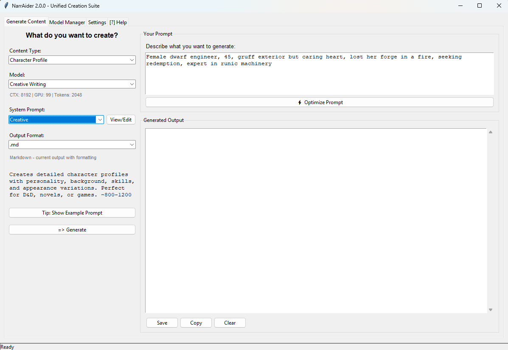

# NarrAider - AI-Powered Narrative Creation Assistant

[](https://paypal.me/andreaslopez)


**Created by Andreas "Uriel1339" Lopez**

**NarrAider** (Narrator + Aid) is a local AI tool for writers to generate worldbuilding content, character profiles, lore documents, magic systems, and individual scenes using local LLMs.

## Features

- **Character Profiles**: Complete bios with progression, alternative outfits, personality traits
- **Magic Systems**: Detailed fantasy magic systems or sci-fi/fantasy hybrids (Mass Effect, WH40K style)
- **Science Systems**: FTL mechanics, technology trees, scientific principles for your setting
- **Artifacts & Relics**: Special items with history, powers, and lore
- **Cultural Backgrounds**: Species sheets, subculture deep-dives, faction overviews
- **Relationship Maps**: Character connections, conflicts, histories
- **Story Concepts**: Create detailed story concept files for long-form generation
- **Scene Writing**: Individual 500-1000 word scenes (dialogue, combat, explicit/non-explicit)
- **Image Prompts**: Generate character art prompts for Stable Diffusion, Midjourney, Nano Banana Pro



## Installation

### Prerequisites

**Python 3.8 or higher required**

Check your Python version:
```bash
python3 --version
```

### 1. Clone or Download NarrAider

```bash
git clone https://github.com/yourusername/NarrAider.git
cd NarrAider
```

Or download and extract the ZIP file.

### 2. Install Python Dependencies

```bash
pip install -r requirements.txt
```

**Platform-Specific Notes:**

**Linux (Debian/Ubuntu):**
```bash
sudo apt-get install python3-tk
pip install -r requirements.txt
```

**Linux (Fedora):**
```bash
sudo dnf install python3-tkinter
pip install -r requirements.txt
```

**macOS:**
```bash
# Tkinter included with Python from python.org
pip3 install -r requirements.txt
```

**Windows:**
```bash
# Tkinter included with Python
pip install -r requirements.txt
```

### 3. First Launch - Easy Setup

**The easiest way to get started:**

```bash
python3 narraider_unified.py
```

The **Setup Wizard** will guide you through:
1. Detecting your GPU
2. Recommending appropriate models for your hardware
3. Providing download links for models and llama.cpp server
4. Setting up paths (you choose where to install)
5. Verifying installation

**All paths are configurable** - install models and llama-server wherever you prefer!

### 4. Manual Setup (Advanced)

If you prefer to configure manually:

#### Download llama.cpp Server

**Windows:**
1. Visit: https://github.com/ggerganov/llama.cpp/releases
2. Download: `llama-b[XXXX]-bin-win-cuda-cu12.2.0-x64.zip` (NVIDIA GPU)
   - Or `llama-b[XXXX]-bin-win-vulkan-x64.zip` (AMD/Intel GPU)
   - Or `llama-b[XXXX]-bin-win-avx2-x64.zip` (CPU only)
3. Extract to a folder of your choice

**macOS:**
```bash
# Intel Mac with Metal support
curl -L https://github.com/ggerganov/llama.cpp/releases/latest/download/llama-b[XXXX]-bin-macos-arm64.zip -o llama.zip
unzip llama.zip
```

**Linux:**
```bash
# Build from source for best performance
git clone https://github.com/ggerganov/llama.cpp
cd llama.cpp
make

# Or with CUDA support:
make LLAMA_CUDA=1
```

#### Download Models

See [QUICKSTART.md](QUICKSTART.md) for model recommendations based on your GPU tier.

**Create a folder for models** (anywhere you like):
```bash
mkdir ~/ai-models
```

Download .gguf files from HuggingFace and save to your models folder.

#### Configure Paths

Edit `narraider_config.json` or use the Settings tab in the GUI to point to:
- Your llama-server executable
- Your model files
- Your preferred output folder

## Usage

### Beginner-Friendly GUI (Recommended):

**Windows:**
```bash
launch_gui.bat
```

**All Platforms:**
```bash
python3 narraider_unified.py
```

**First-Time Setup:**
- Setup wizard detects your GPU and recommends appropriate models
- Step-by-step instructions for downloading models and llama-server
- Automatic verification before first use

**Main Interface:**
1. Select content type from categorized dropdown (Characters & Lore, Scenes & Stories, etc.)
2. Read the description and example prompts for your chosen type
3. Fill in your prompt
4. Click "Generate"
5. Output appears in text box and auto-saves to `outputs/` folder

**Built-in Help:**
- Tab 4 includes tutorial, examples, and troubleshooting tips
- No technical knowledge required

### Advanced GUI (Power Users):

```bash
python3 narraider_gui.py
```

Streamlined interface for users who have already configured their setup and prefer direct access to all options.

### Command Line Mode:

```bash
# Generate character profile
python3 narraider.py --type character --prompt "Elven warrior princess, 200 years old, master swordsman" --output outputs/elara.txt

# Generate magic system
python3 narraider.py --type magic --prompt "Rune-based magic where spells are carved into materials" --output outputs/runecraft.txt

# Generate explicit scene
python3 narraider.py --type scene-explicit --prompt "Two space pirates, tension after near-death escape" --model explicit --output outputs/scene.txt

# Generate story concept
python3 narraider.py --type concept --prompt "Cozy coffee shop romance, small town, autumn vibes" --output concepts/coffee_shop_romance.txt
```

### Output Types:

| Type | Description | Typical Length |
|------|-------------|----------------|
| `character` | Complete character profile with bio, traits, appearance | 800-1200 words |
| `magic` | Magic system with rules, limitations, progression | 1000-1500 words |
| `science` | Sci-fi technology/science system (FTL, weapons, etc.) | 1000-1500 words |
| `artifact` | Special item with history, powers, drawbacks | 600-800 words |
| `culture` | Species/faction cultural background | 1200-1500 words |
| `relationships` | Character relationship web for multiple characters | 800-1000 words |
| `concept` | Complete story concept for long-form generation | 2000-3000 words |
| `scene-dialogue` | Dialogue-focused scene | 500-800 words |
| `scene-combat` | Action/combat scene | 600-1000 words |
| `scene-explicit` | Adult/sexual scene | 800-1200 words |
| `scene-general` | General narrative scene | 500-1000 words |
| `image-prompt` | Character art prompt for image generation | 200-300 words |

## Output Folder Structure

```
NarrAider/outputs/
├── characters/
│   ├── elara_profile.txt
│   └── elara_image_prompt.txt
├── magic_systems/
│   └── runecraft_system.txt
├── scenes/
│   ├── dialogue_tavern_meeting.txt
│   └── combat_dragon_fight.txt
├── concepts/
│   └── coffee_shop_romance_concept.txt
└── cultures/
    └── elven_society.txt
```

## Tips for Best Results

### Character Profiles:
- Include age, species, occupation, personality traits
- Mention 2-3 defining characteristics
- Specify relationships to other characters if applicable

**Example Prompt:**
> "Female dwarf engineer, 45, gruff exterior but soft heart, lost her forge in a fire, seeking redemption, expert in runic machinery"

### Magic Systems:
- Define the source of power (mana, life force, etc.)
- Include limitations and costs
- Mention how it's learned/acquired
- Specify societal impact

**Example Prompt:**
> "Blood magic system where mages sacrifice vitality for power, creates permanent aging, society fears and persecutes practitioners"

### Science Systems:
- Ground in pseudo-science (sounds plausible)
- Include limitations and trade-offs
- Consider societal/economic implications

**Example Prompt:**
> "FTL using quantum entanglement gates, requires massive infrastructure, only governments can afford it, creates travel monopolies"

### Scenes:
- Set the scene (location, time, mood)
- Specify characters involved
- Indicate desired emotional tone
- For explicit scenes, mention relationship dynamic and any specific elements

**Example Prompt:**
> "Tense dialogue between betrayed mentor and former student in rain-soaked alley at night, both armed but hesitant"

## Troubleshooting

### Server won't start:
- Check `llama_server_path` in config is correct
- Verify model file exists at specified path
- Ensure port 8081 isn't already in use
- Check GPU drivers are up to date

### Out of Memory:
- Reduce `context_size` (try 4096 or 2048)
- Reduce `gpu_layers` (try 50 or 25)
- Use smaller quantization (Q4_K_M instead of Q6_K)

### Slow generation:
- Use smaller model (7B instead of 9B)
- Increase `gpu_layers` if you have VRAM headroom
- Use Q4 quantization for speed boost

### Output quality issues:
- Try different model (Gemma vs Mistral)
- Be more specific in prompts
- Increase temperature for creativity (in config)
- Use larger quantization (Q6_K for quality)

## Advanced Configuration

Edit `narraider.py` to customize generation parameters:

```python
GENERATION_PARAMS = {
    "temperature": 0.8,      # Creativity (0.7-1.0)
    "top_p": 0.9,           # Nucleus sampling
    "top_k": 40,            # Top-k sampling
    "repeat_penalty": 1.1,  # Prevent repetition
    "max_tokens": 2048      # Max output length
}
```

## License

MIT License - Free for personal and commercial use

## Credits

- Built on llama.cpp by Georgi Gerganov
- Models from HuggingFace community

## Support

For issues, feature requests, or questions:
- **GitHub**: https://github.com/Uriel1339/NarrAider
- **Discord**: https://discord.gg/ywecg73emj
- **Email**: uriel1339@kidbooks.pics

## Example Output

Generated using **gemma-3-27b-it-Q4_K_M.gguf** on an RTX 4090 with 64GB RAM. Total generation time: ~3-4 minutes (including model loading and llama server startup).

<details>
<summary>Character Profile: Borghild Stonehand (click to expand)</summary>

### Character Profile: Borghild Stonehand

**BASIC INFORMATION**
* Full Name: Borghild Stonehand
* Age & Species: 45 years, Dwarf (Shield Dwarf)
* Physical Appearance: 4'8". Stocky build. Muscle-corded arms. Weather-beaten face. A network of burn scars tracing her left arm and cheek. Braided dark brown hair streaked with grey. Piercing blue eyes.
* Occupation/Role: Engineer, Runesmith, Seeker of Redemption

**PERSONALITY**
* Core Personality Traits: Pragmatic. Resilient. Gruff. Loyal. Secretly compassionate.
* Strengths & Weaknesses: Ingenious problem-solver. Unwavering determination. Skilled craftswoman. Stubborn. Holds grudges. Trusts slowly. Self-blaming.
* Motivations & Goals: To atone for past failures. Rebuild her legacy. Create something lasting and beneficial. Prove her worth.
* Fears & Vulnerabilities: Fire. Losing control. Failing others. Being perceived as weak. Her past catching up to her.

**BACKGROUND**
* Origin/Birthplace: Kraghammer, a mountain hold renowned for its engineering prowess.
* Family & Early Life: Borghild came from a long line of Stonehand smiths. Her father was the Master Engineer of Kraghammer. He instilled in her a love for intricate mechanisms and runic power. She had one younger brother, lost to a mining accident at age 12.
* Formative Experiences: The fire. Ten years ago, Borghild's forge – her pride and joy – burned down. A faulty rune sequence triggered an explosion. Several apprentices were injured. Blame fell on her. She was exiled, stripped of her title. This haunts her.
* Current Situation: Wandering the land. Accepting odd jobs as a repairwoman. Seeking rare components for a new project. Avoiding detection by Kraghammer authorities.

**SKILLS & ABILITIES**
* Special Skills/Talents: Masterful engineer and runesmith. Can diagnose and repair almost any mechanical device. Intuitive understanding of runic energy flow. Able to improvise solutions with limited resources.
* Combat Abilities: Proficient in using a heavy warhammer. Favors practical, defensive fighting style. Relies on strength and durability. Not an agile fighter.
* Magic/Tech Proficiency: Expert level in combining runes with mechanical systems. Can create devices powered by runic energy. Limited knowledge of traditional magic. Prefers tangible results.
* Weaknesses/Limitations: Her creations are complex and require precise calibration. Susceptible to sabotage if someone understands her methods. Physically slower than other races. Overconfidence in her abilities can lead to mistakes.

**APPEARANCE VARIATIONS**
* Default Outfit: Practical leather tunic and trousers, reinforced with metal plates over the shoulders and knees. Sturdy boots. Tool belt laden with wrenches, screwdrivers, and small components. A soot-stained apron.
* Combat/Work Outfit: Full steel breastplate. Reinforced leather gauntlets. Thick padded leggings. Helm with a face guard. She wields her warhammer and carries a satchel of repair tools.
* Formal/Special Occasion Outfit: (Rarely worn) Dark grey dwarven robes embroidered with silver runes. Polished steel belt buckle displaying the Stonehand clan symbol – tarnished from disuse.
* Distinctive Accessories: A pair of goggles perpetually perched on her forehead. A small, intricately carved stone amulet depicting a hammer and anvil – a gift from her father. The burn scars are always visible.

**CHARACTER PROGRESSION**
* Arc Potential: Borghild could rediscover her confidence. She might confront the truth about the fire. Redemption through creation is possible. Learning to trust again is crucial for growth. Could become a leader, using her skills to help others.
* Key Relationships: A young apprentice she reluctantly takes under her wing. A grizzled mercenary captain who provides protection (and challenges). An elven scholar seeking lost runic knowledge. Someone connected to the events surrounding the forge fire.
* Internal Conflicts: Guilt over the fire versus a desire for forgiveness. Pragmatism versus compassion. Self-reliance versus the need for connection. The weight of her past hindering her future.

**VOICE & MANNERISMS**
* Speech patterns: Direct and concise. Uses few unnecessary words. Often speaks in technical jargon. Sarcastic undertones. Short, clipped sentences. Rarely uses honorifics.
* Distinctive mannerisms: Constantly fiddles with tools or components. Scowls frequently. Taps her fingers when thinking. Inspects everything critically. Has a habit of muttering to herself while working.
* Emotional tells: A slight tremor in her voice when discussing the fire. Her grip tightens on her hammer when angered. A rare, fleeting smile reveals a glimpse of vulnerability. She avoids direct eye contact when lying or ashamed. When truly focused she will forget to blink.

</details>

## Changelog

### v1.0.0 (2026-01-31)
- Initial release
- Character, magic, science, artifact, culture generators
- Scene generation (dialogue, combat, explicit, general)
- Story concept generation for worldbuilding projects
- Beginner-friendly unified GUI with setup wizard
- GPU detection and tiered model recommendations (RTX 4090 vs RTX 3080)
- Advanced GUI for power users
- Command-line interface for automation
